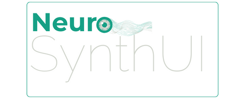

<p align="center">
  
</p>

# NeuroSynthUI
[](https://choosealicense.com/licenses/mit/)

NeuroSynthUI is a modern React component library designed to provide developers with a set of pre-built components that can be used to create beautiful and functional user interfaces with ease.

## Features

- A comprehensive set of UI components
- Built with React and TypeScript for robust applications
- Fully customizable components
- Storybook integration for component documentation and testing
- Jest for unit testing

## Getting Started

To get started with NeuroSynthUI, you need to have Node.js installed on your system. If you don't have Node.js installed, you can download it from [nodejs.org](https://nodejs.org/).

### Installation

You can install NeuroSynthUI in your project by running the following command:

```sh
npm install neurosynth-ui
```

or if you are using `yarn`:

```sh
yarn add neurosynth-ui
```

### Usage

After installation, you can import and use the components in your React application:

```jsx
import { Button, Modal } from 'neurosynth-ui';

function App() {
  return (
    <div>
      <Button label="Click Me" variant="primary" />
      <Modal isOpen={true} onClose={() => {}} title="Welcome">
        Hello, World!
      </Modal>
    </div>
  );
}

export default App;
```

## Running Locally

To run the NeuroSynthUI locally for development, follow these steps:

1. Clone the repository:

```sh
git clone https://github.com/your-username/neurosynth-ui.git
```

2. Install the dependencies:

```sh
cd neurosynth-ui
npm install
```

3. Start the development server:

```sh
npm run dev
```

This will start the Vite development server, and you can begin working on the components.

## Storybook

NeuroSynthUI uses Storybook to showcase its components. To view the components in Storybook, run:

```sh
npm run storybook
```

This will start the Storybook server, and you can view the component stories by navigating to `http://localhost:6006` in your browser.

## Building for Production

To build the NeuroSynthUI library for production, run:

```sh
npm run build
```

This will generate the production build of the library in the `dist` directory.

## Running Tests

NeuroSynthUI comes with Jest set up for testing. To run the tests, use:

```sh
npm test
```

To run tests in watch mode:

```sh
npm run test:watch
```

## Linting

To ensure code quality and consistency, you can run the linter using:

```sh
npm run lint
```
## Components
- [x] Avatar: A graphical representation of the user, commonly used for profiles and user interfaces.
- [x] Button: An interactive element that triggers actions when clicked by the user.
- [x] Card: A flexible and extensible content container with multiple variants and options.
- [x] Collapse: A component to show and hide content with a smooth animation, enhancing the UI's interactivity.
- [x] DropdownMenu: A list of options that appears below a clickable element, allowing for additional actions related to an item.
- [x] IssueCard: A visual summary of an issue, task, or feature that displays its status and other key details.
- [x] List: A way to display a series of items as a single continuous element, often used for menus and grouped information.
- [x] Modal: A dialog box/popup window that is displayed on top of the current page for critical user interactions.
- [x] NestedList: A list with hierarchical items that can expand and collapse, providing a clear structure of the included content.
- [x] README.md: A markdown file providing documentation about the project and its components.
- [x] Select: A control that allows the user to choose one or multiple options from a dropdown list.
- [x] TextField: An input field allowing the user to enter and edit text.
- [x] Toolbar: The primary navigation bar, providing quick access to features and indicating the user's current context.
- [x] Warning: A component to display alerts or warnings to the user, often used to highlight potential issues or important information.
- [x] AppBar: For main navigation, quick access to features, and indication of the user's current context.
- [x] Tabs: To toggle between different views or sections within the same context, like different panels of information in a project.
- [x] Tooltip: Small informational messages that appear when hovering over an element, useful for explaining the function of buttons or other interface actions.
- [x] ProgressBar / Loader: To display the progress of a task or the loading of information, improving user experience during wait times.
- [x] Table: A listing of items with multiple columns, essential for visualizing large amounts of data, such as tickets, tasks, or reports.
- [x] Pagination: A component for page-by-page navigation, especially useful in tables with lots of data.
- [x] Breadcrumbs: To show the navigation path within the application and facilitate returning to previous points.
- [x] Tag / Chip: For labeling categories, statuses, people, or any other form of compact and visual metadata.
- [x] Dialog / Confirm: Dialogue boxes to confirm critical user actions, such as data deletion or significant changes.
- [x] DatePicker: Fundamental for setting deadlines, marking events, and other functionalities related to time.
- [x] TimePicker: Similar to the date picker, but for specific times, useful for precise scheduling.
- [x] Accordion: To expand and collapse content sections, keeping the interface clean and organized.
- [x] Timeline: Shows a timeline of events, change history, or task progress.
- [x] Sidebar / Drawer: A side menu that can contain navigation, filters, or additional information.
- [x] Snackbar / Toast: For temporary and informative messages that do not require user action to disappear.
- [x] EmptyState: A visual representation for when there's no data to display, with instructions or actions for the user.
- [x] Stepper: For step-by-step processes, like setup wizards or project creation.
- [ ] KanbanBoard: A draggable component for visualizing tasks in Kanban style, useful for agile project management.

## Contributing

Contributions to NeuroSynthUI are always welcome. Please read the contributing guidelines before making any changes or opening a pull request.

## License

The MIT License (MIT)

---
